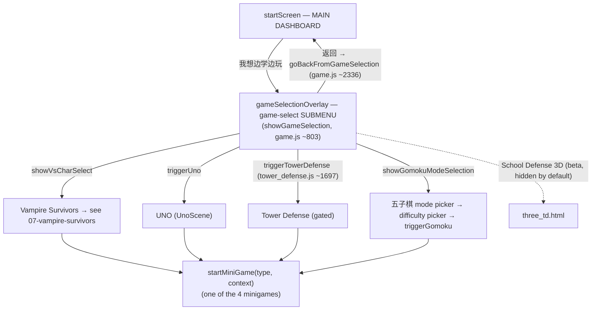
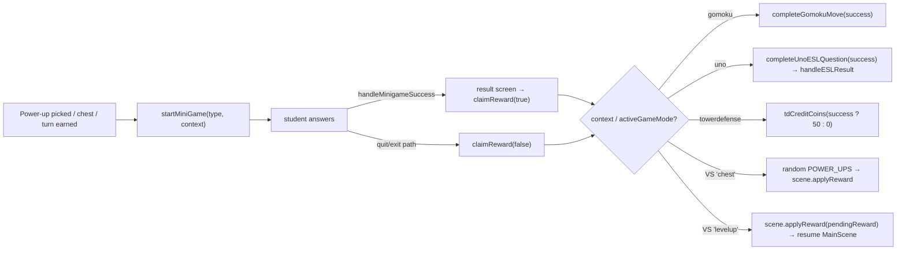

# Game Modes & Minigames

> **Last verified:** 2026-09-04 · **Part of:** [Classroom-survivors Repo Wiki](README.md)

**Owner files:** `game.js` (2345 lines — menus, dispatch, the four DOM minigames, audio stack), `boot.js` (Phaser config, `registerScene`, `activeGameMode`, HiDPI enter/exit), `config.js` (`TD_ENABLED` / `THREE_TD_ENABLED` URL gates), `tower_defense.js` (1808), `gomoku.js` (781), `uno.js` (1821), `index.html` (`#gameSelectionOverlay` ~508, minigame overlays, TD HUD ~663+).

`game.js` is the hub: it owns the game-selection submenu, the minigame dispatch, the reward plumbing (`claimReward`), the procedural-audio stack (`initAudio`, `osc`, all `synth*`, `playTTS` fallback chain), and the shared widget helpers (`fitAnswerArea`, `showTranslation`, `showVocabImage`).

## Menu hierarchy & entry points

`showGameSelection (~803)` is the canonical "return to menu" that also acts as a reset: it hides every screen, cancels pending UNO stop timers, stops `MainScene`/`UnoScene`, calls `exitHiDpi()` (boot.js) to restore the shared canvas to CSS-px RESIZE, hides the canvas + VS buttons, clears the minigame countdown, sets `activeGameMode = null`, then shows `#gameSelectionOverlay` and calls `applyVsPromo()` (the once-per-user "new improved VS" badge — [Vampire Survivors](07-vampire-survivors.md)) and `applyTowerDefenseGate()`.

`goBackFromGameSelection (~2336)` hides the submenu and shows `#startScreen` with `step-greeting` visible — it is the **dashboard return**, also used by `exitStudyMode` ([Study Mode](05-study-mode.md)).

## The minigame dispatch — 🔴 counterintuitive naming

`startMiniGame(type, context)` (`game.js ~1079`) is the single entry. `context` is `'levelup'` (default), `'chest'`, `'gomoku'`, `'uno'`, or `'towerdefense'`. On a throw it recovers via `claimReward(false)` (~1094) so the scene can never be left paused with no overlay.

| `type` string | Dispatched function | What it ACTUALLY is | Containers |
|---|---|---|---|
| `'spelling'` | `startSpellingGame (~1239)` | **Letter-based WORD SCRAMBLE** — letters drawn from the word's own letters into fixed slots via a static bubble palette. NOT type-from-keyboard. | `#spellingGame`, `#spelling-input-display`, `#spelling-keyboard` |
| `'wordrec'` | `startWordRecGame (~1576)` | Listen & pick the word (5 choices, 5s shrinking timer bar) | `#wordRecGame`, `#rec-options` |
| `'scramble'` | `startGrammarGame (~1652)` | **Sentence/word reorder** (the "Sentence Scramble") | `#grammarGame`, `#sentence-container`, `#word-dock` |
| `'sentencematch'` | `startSentenceMatchGame (~1976)` | Pair questions with answers (tap-to-place) | `#sentenceMatchGame`, `#sentencematch-pairs`, `#sentencematch-dock` |

So "spelling" exists twice with different mechanics: study **Round C** is the 10-key typing game, while game-mode `'spelling'` is a scramble. When the user says "word scramble (study and game mode)" they mean study Round B **and** this `'spelling'` minigame — they must behave identically for separators. Always re-derive from code.

### Game-mode spelling (the scramble) mechanics
- State lives on the element: `#spellingGame.dataset.*` (`targetWord`, `slots`, `letters`, `placement`, `usedKeys`, `feedbackMode`) plus `gameEl._spellingResetTimer`. `placement[letterIdx] = keyIndex` + `usedKeys[]` decouple palette index from slot position (the `opposite`-desync bug class).
- Fixed separators use the same pinned set as study Round B: `punct = [' ', '-', '.', '?', '!']` in **both** `startSpellingGame (~1262)` and `checkSpelling (~1523)` — change both together with study_mode.js when altering the list.
- `buildSpellingKeyboard (~1422)` builds the bubble palette **once** (`dataset.built` guard); it never depletes. `handleSpellingInput (~1444)` copies into the earliest empty letter-slot; `removeSpellingLetter (~1475)` deletes (gap preserved, bubble freed). `clearSpelling (~1495)` is blocked only during the success reveal. `checkSpelling (~1514)` reveals green/red, freezes via `feedbackMode="true"`, and on wrong schedules a 5s reset that re-fills placement/usedKeys — the source is static so nothing needs restoring.
- `fitAnswerArea (~1371)` shrinks `--answer-font` + `--slot-size` until the row fits (measures real rendered slot boxes, not CSS-var text); a debounced `resize` listener (~1411) re-fits while the overlay is visible.

### Grammar / sentence-scramble mechanics (`'scramble'`)
- `startGrammarGame` picks an SR sentence (`getGameItemSR`), stores `validOptions` + `targetSentence` on `#grammarGame`, tokenizes on spaces, creates one `.drop-zone` per token (all tokens = blanks), and fills `#word-dock` with shuffled `.draggable` tiles. **The dock DEPLETES**: `placeGrammarWord (~1747)` appends a copy into the earliest empty zone and removes the dock tile; `deleteGrammarWord (~1764)` returns a fresh tile to the dock.
- **Delegated listeners ONLY** — registered once at module load (`game.js ~2238` and `~2243`) on `#word-dock` (place) and `#sentence-container` (delete placed). **Never also bind per-element `onclick`** — the click then fires twice (double-place / double-return). If a word places/deletes twice, grep for both a delegated listener and a stray per-element handler in the same function.
- `clearGrammar (~1781)` has **no frozen guard on purpose**: it cancels `_grammarResetTimer`, restores every placed tile to the dock, unfreezes — CLEAR works during the reveal. The 5s wrong-answer reset inside `checkGrammar (~1811)` must likewise restore tiles (a bare `.remove()` permanently loses words once the dock depletes).
- `checkGrammar` grades against ANY `validOptions` entry first (accepts valid reorderings), falls back to per-slot `dataset.expected`. On success it records SR **at check time** (before the speech gate — the gate must never affect SR state), then renders `window.SpeechUI.makeSentenceGate(...)` into the dock with `mode:'game'`; `onDone` calls `handleMinigameSuccess('grammar')`. Without speech readiness it goes straight to success.
- Wrong → `frozen="true"`, 5s restore timer, unfreeze.

### Word rec & sentence match
- `startWordRecGame` picks a weighted vocab item, builds 5 choices, and runs a 5s bar (`recTimer`, 50ms ticks); a wrong pick red-shakes and re-rolls the round. Word-level speech was removed — the minigame succeeds immediately on the right pick.
- `startSentenceMatchGame` uses `getGameSentencePairsSR`; fallback pairs are generic (`What's your name?` etc.). Slots/dock use per-element `onclick` here (no delegation) with SR tracked per pair (`dataset.pairAttempts`/`pairQueued`); wrong answers reset all tiles after 2s.

## Rewards flow (`claimReward`, ~1103)

`claimReward` stops the countdown, hides all four minigame overlays, adds the minigame duration to `totalMinigameTimeMs`, then routes on `rewardContext`/`activeGameMode` **before** the VS path (`game.js ~1122–1135`). For VS it applies the reward to `MainScene` and resumes the scene. `handleMinigameSuccess (~2171)` shows the result button (text differs: `CONTINUE!` for gomoku/uno, `GET POWER UP!` otherwise) and records spelling SR at success time.

### Timer features (MINIGAME_TIMER_FEATURES.md, verified in code)
`startMinigameCountdown (~1037)` ticks every 100ms while a minigame is open. Current behavior (changed since that MD): the countdown **no longer deducts survival time** — the VS scene is *paused* while a minigame is open, so the old double-deduction made the HUD clock run backwards and the 10-minute final boss unreachable (note at ~1071). The only displayed timer is **Gomoku speed mode's** next-AI-move clock; all other modes render an empty string. Game-over stats (`finalLevel`, `finalSurvivalTime`, `finalMinigameTime`, `finalScore`) are computed in the VS scene's `populateGameOver` ([Vampire Survivors](07-vampire-survivors.md)), not in game.js.

## The global keydown listener & the `STUDY_STATE.active` guard

`game.js ~2253`: `if (typeof STUDY_STATE !== 'undefined' && STUDY_STATE.active) return;` — Study Mode owns the keyboard first. Otherwise, while `#spellingGame` is visible it routes to `handleGameSpellingKeyDown (~2269)`: Enter = check (prevented from re-triggering a focused CLEAR button via `preventDefault`), Backspace = remove the last placed letter, letter keys = first matching **unused** bubble (so the two `p`s in `opposite` each get their own). `STUDY_STATE.active` is only cleared by `exitStudyMode` — if study exit forgets it, physical typing dies here (see [Study Mode](05-study-mode.md)).

## SR plumbing for game sessions

`srGameResults`, `srInSessionFailures`, `srInSessionSuccesses`, `srLastServedKey` (`game.js ~1229–1235`) reset in each game's trigger function. Rules enforced across all four minigames: a failure is recorded at the **first** wrong check; a later success deletes the failure and joins the success set (deleting alone would drop the key back to its still-due group); the same item is never served back-to-back (`srLastServedKey`). Content pools are loaded by `loadContent (~1158)` from `TEACHING_CONTENT` via the SR page ordering, falling back to placeholder items if empty.

## Tower Defense (`tower_defense.js`, 1808 lines)

Vertical Plants-vs-Zombies-style "School vs Zombies" lane defense. `TowerDefenseScene (tower_defense.js ~461)` self-registers via `registerScene()` (boot.js); zombies march **down** a 5×7 grid toward the school at the bottom. Key constants (~11–53): `TD_START_COINS=75`, `TD_START_BASE_HP=20`, `TD_ESL_SLOW_FACTOR=0.4` (zombies at 40% speed while a minigame is open), `TD_ESL_LINGER_MS=2000`. Nine towers (`TD_TOWERS`, ~19: pencil, star, desk, eraser, popquiz, ruler, textbook, trap, firedrill) with per-tower HP; upgrades (`TD_UPGRADE_*`, `TD_MAX_LEVEL=3`) scale damage/rate/HP and full-heal. Five enemies (`TD_ENEMIES ~37`: dropout, backpack, nerd, bully (vaults the first tower), librarian (enrages <30% HP)). Zombies attack **every** tower, not just the desk; a `TDBlockPuppet` (~213, `TD_PUPPET_TEST`) prototype animates every other dropout as a Minecraft-style code rig. Difficulty phases `TD_PHASES (~46)` are tuned so a player who never answers ESL loses around the 2-minute mark.

**ESL contract (do not break):** HUD 📖 ANSWER button → `tdStartESL()` (~1763, shows `#tdSlowOverlay`) → `scene.startESL() (~1434)` sets `eslSlowActive=true` and calls `startMiniGame('spelling','towerdefense')` → `claimReward` routes to `tdCreditCoins(success ? 50 : 0)` (`game.js ~1132`) → `scene.onESLComplete (~1442)`: +50 coins, slow lingers 2s, overlay hides.

**Gate** (`config.js ~45`, `applyTowerDefenseGate` tower_defense.js ~1788): `TD_ENABLED` is runtime URL-derived — `?td=1`/`?td=0` overrides, localhost/`file://` enabled, path starting `/classroom-survivors-preview` enabled, live site disabled (button disabled + greyed + "Coming soon", trigger a no-op). Merge-safe: no per-branch flag to carry. `THREE_TD_ENABLED` (config.js ~61) similarly gates the `three_td.html` button, but hides it entirely instead of greying. Handoff detail (art plan, sprite wiring, balance status) lives in `TD_HANDOFF_QODERCN.md` at the repo root — read it before touching TD.

## Gomoku (`gomoku.js`, 781 lines)

Five-in-a-row vs the computer — **solo, DOM/2D-canvas** (not a Phaser scene; `triggerGomoku (~75)` calls `exitHiDpi()` to keep the shared Phaser canvas clean). Modes: **regular** (mode/difficulty pickers → `startGameWithDifficulty`, Easy/Hard/Hardest via `findBestMove(perfect)` heuristics ~566) and **speed** (`triggerGomoku('speed')`, AI moves on an interval `getGomokuSpeedInterval`, countdown shown in the minigame timer). Every player move triggers an ESL minigame: `showGomokuMiniGame (~461)` picks a random type and calls `startMiniGame(type,'gomoku')`; success places the stone (`completeGomokuMove ~470`), failure returns the turn with "Wrong! Try again." The board uses a 15×15 grid with a panning viewport (`expandGomokuViewport ~141`) and drag-and-drop.

## UNO (`uno.js`, 1821 lines)

`UnoScene` (registers via `registerScene`, `uno.js ~1737`) — solo vs **3 AI bots** (4-player, generated card textures, camera-tilt reverse animation). ESL hooks: `triggerUnoESL(ctx) (~1562)` fires on the player drawing while stacked (`'draw'`, ~1131) or before playing a black card (`'black'`, ~1557); it pauses the scene timer, opens `#unoESLOverlay`, starts a 20s countdown (`UNO_ESL_TIME_LIMIT`, `uno.js ~8`), and launches a random minigame with `context:'uno'`. `handleESLResult (~1585)`: correct-in-time → draw 1 / free play; too slow → draw 2 / draw 1. `claimReward` routes here through `completeUnoESLQuestion (uno.js ~1740)`. `endUno (~1637)` finalizes SR, queues a `uno` session event, applies the same **2-minute ignore rule** as VS (`isSessionIgnored`, below), awaits the flush deadline, and schedules a *cancelable* scene stop (`window.unoStopTimeout` — trigger functions cancel it so a quick replay can't be killed by a stale stop).

### Win/loss framing shared by VS and UNO
A win always counts. A loss counts only if survival/game time ≥ 120s (`isSessionIgnored` — VS `populateGameOver` ~3644, UNO `endUno` ~1662); ignored sessions show "本次练习不计入每周目标" and are excluded from the weekly target. Both use `finalizeSession(srGameResults, !ignored)` + `queueSessionEvent(...)` + `await flushAnalyticsWithDeadline(4000)` — see [Telemetry](14-telemetry.md).

## HiDPI & the shared canvas (why game switching is fiddly)

All Phaser games share ONE canvas. VS runs it in HiDPI (`enterHiDpi`, boot.js ~90: backing = CSS×DPR capped at 2, Scale.NONE + zoom). Every other mode requires `exitHiDpi() (~104)` first — it restores Scale.RESIZE and clears the inline canvas styles; skipping it leaves a stretched/invisible canvas (observed: invisible UNO cards after VS). `triggerUno`, `triggerVampireSurvivors`, `triggerTowerDefense`, and `showGameSelection` all contain canvas-restore and stale-stop-timer logic for exactly this reason. `vs_uno_transition_test.js` and `vs_dpr_test.js` pin these invariants.

## The audio stack in game.js (owner-file content)

- **SFX master gain + mute** (~65–94): every synth and sampled SFX routes through one `sfxGainNode` so `#vsMuteBtn` silences them all (`sfxMuted` in localStorage); BGM (bgm.js, own context) and TTS learning audio are never muted by it.
- **iOS audio session keep-alive** (~96–168): a silent looping `<audio>` (runtime-built WAV data-URI) keeps the iOS "playback" session promoted so WebAudio ignores the silent switch; `_unlockAllAudio` resume listeners on `touchend`/`pointerdown` plus a `WeixinJSBridge` hook fix WeChat-iOS suspended contexts; `visibilitychange` resumes on return.
- **Procedural synths**: `osc`/`noise` primitives; UI/game sounds `synthError`, `synthHappy`→`synthLevelUp`, `synthHurt`, `synthDeath`, `synthLootbox`, `synthGem`; VS weapon SFX with per-key throttling (`sfxOK` ~350) so crowds make one sound — `synthSwoosh`, `synthPlaneHit`, `synthStab`, `synthSwordSlash`, `synthArcHum`, `synthZap`, `synthRicochet`, `synthSmash`, `synthEraserPass`, `synthPageFlutter`, `synthBombFall`, `synthSplash`.
- **Sampled SFX** (~483–520): `loadSfxSample`/`playSfxSample` decode `sfx/*.mp3` once (via AssetCache); a `false` return means "use the synth fallback".
- **`playTTS` (~630)** — the learning-audio fallback chain (field-tuned 2026-07-28): cached MP3 (IndexedDB) → Youdao TTS (mainland CDN) → local MP3 via gh-proxy mirror (seeds the cache) → Baidu Fanyi TTS → browser `speechSynthesis`. Each hop has a timeout and a settled flag so a hanging source falls through instead of stalling the lesson. Callers set the global `currentTTSWord`.

## Which tests cover this

- `test_td_gate.js` — jsdom: the live/preview URL gate (button disabled + "Coming soon" on live, no-op trigger; enabled on preview/localhost/file://).
- `test_td_core.js` — Playwright + real Chrome: TD core behaviors (in the `npm test` chain; see [Testing](12-testing.md), which also lists the 10-file chain and harness styles).
- The minigame widgets themselves are pinned by `test_widgets_regression.js` (jsdom, real scripts) — game-mode spelling parity with study Round B is asserted there.
- Gomoku/UNO have no automated tests; verify manually (see `TD_HANDOFF_QODERCN.md` §4 for the local-server + `?td=1&testMode=true` URL pattern).

## Update discipline

Any agent that changes code covered by this page must update this page in the same commit. The wiki is the single source of truth; skills/memory hold only behavior rules and point here.
