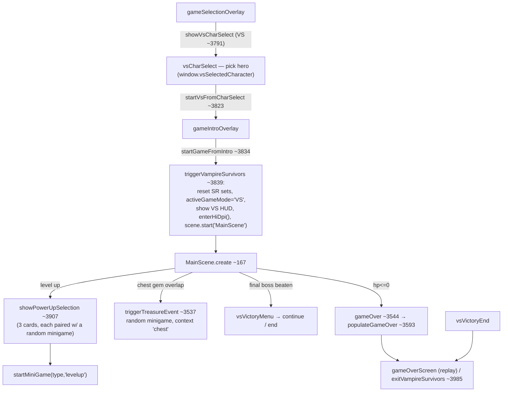
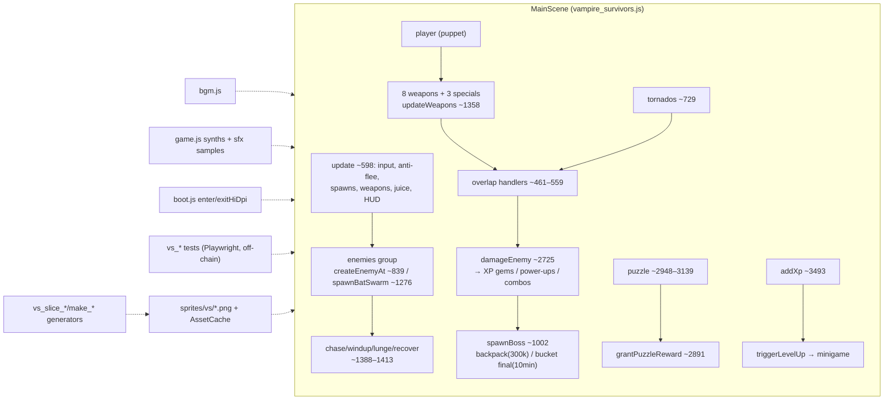

# Vampire Survivors: Architecture & vs_* File Index

> **Last verified:** 2026-09-04 · **Part of:** [Classroom-survivors Repo Wiki](README.md)

**Owner files:** `vampire_survivors.js` (4035 lines — the whole game, one `MainScene` + wrapper functions), the `vs_*` family (30 files, indexed below), `boot.js` (shared Phaser config + HiDPI), `bgm.js` (music), `index.html` (VS HUD, char select, intro, victory menus), `sprites/vs/` (art sliced by the generator scripts).

"Vampire Survivors" here means **Classroom Survivors** — the flagship survival game (`MainScene`, key `'MainScene'`). The player is a chibi student fighting rats/bats/dropout zombies on a schoolyard; every second mechanic is an ESL exercise.

## Architecture

### Lifecycle



`triggerVampireSurvivors` is restart-safe: on a live `game` instance it cancels `window.unoStopTimeout`, stops both scenes, re-parents the canvas to `<body>`, calls `enterHiDpi()` (boot.js ~90 — backing = CSS × DPR capped at 2), and starts a fresh `MainScene` after a 100ms layout delay. `exitVampireSurvivors (~3985)` stops the scene, calls `exitHiDpi()`, hides HUD/overlays, and returns to the game-select submenu.

### Entity model

Everything spawns into physics groups in `create (~306–311)`: `enemies`, `bullets`, `fireWakes`, `gems`, `tornados` (physics groups) and `powerUps` (display group — picked up by distance check, no bodies). The **player** is a paper-doll puppet container (body/arm/feet part images per hero, `VS_CHARACTERS ~47`) or an emoji fallback (`🧙‍♂️`); body is a tight circle (r=22 puppet / 16 emoji, ~344) — the old loose hitbox caused "hit out of nowhere". **Enemies** (`createEnemyAt ~839`): type 0 rat / 1 bat / 2 zombie, chosen as an even random mix per spawn. **Bosses**: `spawnBoss (~1002)`. **Items**: XP gems (`spawnXpGem ~2822`, gold star, value 5; bosses drop 5×15), power-up boxes (`spawnPowerUp ~2836`, teal box, walk-on radius), chest gems. **FX**: pooled burst particles + damage-pop texts (`particlePool`/`popPool`), `fx_slash` 12-frame spritesheet, screen shake/flash, combo counter.

### Spawn / wave system

`update (~598)` ticks a `spawnTimer`: every `max(3, 19/difficulty)` frames `spawnEnemy (~810)` places an enemy on a circle just off-screen. At **300 kills** the next spawn is a **boss** instead (~810): regular = backpack zombie; after a win, bosses alternate backpack/bucket. Hard perf caps: 140 live enemies (~825), 160 absolute (~840). Every 3000–4200 frames a **bat swarm** crossfires from a random edge (`spawnBatSwarm ~1276`, 20+difficulty×5 bats at 3× player speed, half HP, die after 5s). Every 5 player levels a **circle of 80 zombies** closes in (`spawnEnemyCircle ~1057`). Difficulty (`getDifficulty ~1344`) is linear 1→2 over the first 5 minutes of `accumulatedTime`, then exponential doubling every 120s — **it uses accumulatedTime, not wall time, so it does not scale while a minigame is open**.

### XP / level-up

Enemies drop gems; the magnet pulls them in from 360px (`updateGems ~3480`). `addXp (~3493)`: threshold `nextLevelXp` starts at 30, ×1.5 per level, triggers `triggerLevelUp (~3532)` → `scene.pause()` + `showPowerUpSelection('levelup')`. The menu offers 3 shuffled power-ups (each paired with a random minigame type; hero-exclusive weapons filtered out) with milestone text from `WEAPON_MILESTONES` (~33). Chests instead run `triggerTreasureEvent (~3537)` — a random minigame with `context:'chest'`, rewarding a random `POWER_UPS` entry.

### Weapons & abilities

`playerStats.weapons` (`{type, level, timer, cooldown, ...}`); `updateWeapons (~1358)` fires on cooldown via `fireWand/fireWhip/fireRuler/fireAxe/fireCross/fireKnife/fireSantaWater` (~1641–2439) and updates the orbiting-eraser weapon inline (~1572). Evolution milestones are per-tier (`evoTier`: L2-4/L5-7/L8+, ~128): piercing wand, splitting scissors (`spawnKnifeSplit ~144`, perf-guarded at 200 bullets), book AOE blast, triangle ricochet (`nearestEnemyExcluding ~131`), frost erasers (chill), ruler electric arc (stun, bosses immune), whip fireball wake. Specials: `heart` (+30 HP), `vortex` (vacuums all XP gems), `tornado` (`spawnTornado` — spiral funnel with twin wind-trail arms and 190px suction, driven in `update` ~729). `applyReward (~3715)` handles level-up math and per-weapon cooldown reductions.

### Boss system (verified)

- **Regular boss** = **backpack zombie** every 300 kills (~810). HP = 25× base enemy HP. Post-win, bosses alternate backpack → bucket → … (`regularBossCount`).
- **Final boss** = **bucket zombie**, spawned **once at 10 minutes** of accumulated play time (~724), ×3 HP, ×2 damage (`dmgMult`), bigger body (r=50), `☠️ 最终BOSS！☠️` warning. Beating it → `onFinalBossDefeated (~3686)` → victory menu (continue playing / end; both still count as a win).
- Bosses are immune to knockback/stun/freeze (they'd never reach the player otherwise — `damageEnemy ~2753`), lunge at 540px/s for 420ms so the pounce actually covers their 200px attack range (~1400), and keep their own hit-frame feedback. Boss combat fixes (opacity self-heal, lunge reach, frame/state match) are pinned by `vs_bosscombat_test.js`.

### Damage / hitbox approach

Bullet↔enemy overlaps are three `physics.add.overlap` handlers (~461–559) keyed on `bullet.type` (`axe`/`cross` hitList non-consumption + AOE/ricochet, `rulerarc` pierce+freeze, `wand` pierce, `knife` split, else destroy-on-hit). Enemy bodies are **sized to the drawn frame** per type (~867: zombie r=42% of height nudged up to include the head, bat 38% of max dim, rat 36%) — the old fixed 10px circle let bullets pass through the dropout's head (pinned by `vs_hitbox_test.js`). Player damage only lands on a connecting **lunge** (or swarm-bat contact, `handlePlayerHit ~2667`): damage `min(25, ceil(difficulty)) × dmgMult`, 60-frame invulnerability, attacker flash + ring + streak (`flashAttacker ~2708`), no player knockback (pinball problem).

### DPR handling & device matrix

VS renders HiDPI: `enterHiDpi()` (boot.js ~90) sets backing = CSS × `vsDpr()` (= `min(2, devicePixelRatio)`, ~63), Scale.NONE + ScaleManager zoom = 1/DPR, and the camera zoom = `fit × DPR` (`handleResize ~3752`). `cw()/ch()/hudX()/hudY() (~3774)` convert CSS screen coords for scrollFactor(0) HUD elements. `exitHiDpi()` must run before any other game reuses the canvas (stale inline styles → stretched/invisible UNO). `vs_dpr_test.js` verifies backing/zoom/world↔screen round-trip at DSF 1/2/3 plus UNO restore; `vs_device_matrix_test.js` runs VS+UNO+Gomoku across emulated device profiles asserting the same adaptive-sizing invariants.

### How the sprite "slices" work (`vs_slice_*` / `vs_shrink_parts`)

**"Slicing" is an offline asset pipeline, not runtime code-splitting.** Art arrives as AI-generated sheets (e.g. `sprites/vs/player_parts_raw.png`, `item_sheet_raw.png`, magenta-background enemy sheets). A `vs_slice_*` script (playwright-core + a real headless Chrome, canvas `getImageData`) then: strips the baked checkerboard/magenta background by flood-fill from the borders, erases grid lines, finds connected components, classifies them (body/arm/feet; item cells), and writes individual PNGs under `sprites/vs/` — which `MainScene.preload` then loads through `AssetCache`. `vs_shrink_parts.js` pre-downscales the puppet parts to 0.4× (two-step) so phones don't GPU-minify 11:1 (NPOT textures get no mipmaps in WebGL1). `vs_reslice_tornado.js` re-slices one cell with a *tighter* checker predicate (brightness ≥ 210) after the loose key ate the grey tornado swirl. `test_asset_manifest.js` keeps `AssetCache.VS_SPRITES` in sync with what's on disk (`_raw` sheets excluded).

### Portraits & FX generators

`vs_make_portraits.js` composes `portrait_monitor.png`/`portrait_skippy.png` from the body+arm parts using the **same layout constants as the in-game puppet** (arm pivot (16,−1), origin (0.12,0.18), 15° base angle, body at (0,−10), PS=0.45). `vs_make_fx_slash.js` bakes the 12-frame `fx_slash_sheet.png` (4×3 grid of 512px cells) used by the ruler slash.

### Audio / SFX

Procedural synths live in `game.js` (throttled per key via `sfxOK`, routed through the `sfxGainNode` master mute — never TTS). Sampled SFX: `loadSfxSample`/`playSfxSample` (game.js ~488–520) decode `sfx/*.mp3` once into WebAudio buffers via AssetCache (GFW-resilient); a `false` return means callers fall back to the synth, and a throttled call returns `true` so the synth doesn't double-fire. `MainScene.create` pre-decodes the 11 VS samples (~575). BGM (`bgm.js`) is a separate gapless-loop WebAudio player started/stopped on scene create/shutdown (~226); it **auto-ducks** (minigame overlay 25%, prompt audio 25%, recording 6%) and VS puzzles duck explicitly (`BGM.duck('prompt')` ~3039). `vs_sfx_test.js` / `vs_sfx_samples_test.js` verify hooks and decodes.

### Anti-flee (`updateAntiFlee ~914`, pinned by `vs_antiflee_test.js`)

Kids flee in a straight line; two nudges force engagement: (1) an elastic **fence** — a chalk-style ring at `arenaRadius = 1800` around the run's start center pushes the player back with a spring force (≤480) and glows near the boundary; (2) after ~2.5s of consistent heading, a **wall of 16 enemies** rises just off-screen ahead (`spawnEnemyWall ~963`, camera shake cue, 6s cooldown). `arenaCenter` is reset in `create` — a stale one from the previous run left the fence invisible on the second playthrough.

### Walking puzzles (the battlefield ESL layer, `vs_puzzle_test.js`)

Power-up boxes start a **walking puzzle** (`startWalkingPuzzle ~3001`): token boxes (letters for words, words for sentences) scatter in a shuffled ring; the student walks over them in order. `pickPuzzleContent (~2948)` strictly alternates word/sentence and pulls via `getGameItemSR` with `puzzleDone` in-session dedup. `updatePuzzle (~3068)` applies a subtle magnet — correct boxes get a 1.15× pickup radius, wrong 0.85×, nearest-correct preferred. Validation compares **values** (duplicates interchangeable) only when the last box is collected; wrong → ESL-style reveal (green/red), 1.6s hold, all boxes reset. The reward (`grantPuzzleReward ~2891`) is granted only on solve.

### Transition to UNO & the promo/lifecycle mechanics

The VS↔UNO canvas handoff is the fragile seam: VS's HiDPI mode must be undone (`exitHiDpi`) or UNO renders stretched/invisible. Pinned by `vs_uno_transition_test.js` (backing === innerWidth, UnoScene runs, no errors), `vs_input_uno_test.js` (joystick works + UNO cards visible after VS), and `vs_transition_repro.js` (the original PC repro for both bugs). **Promo**: `applyVsPromo` (game.js ~790) shows the "全新升级版" badge + glow on the VS button **once per user** — server-persisted `vsPromoSeen` on the student record (via `updateStudent`) with a per-user device mirror (`vsPromoSeen_<id>`) and an anonymous `vsPromoSeen` localStorage fallback; every menu-reveal path calls it. `vs_promo_test.js` / `vs_promo_lifecycle_test.js` pin the full menu→play→exit→menu lifecycle including the relogin-dropped-flag regression.

### Timer, win/loss, session accounting

The HUD clock counts **only fight time**: `accumulatedTime += delta` only while `PLAYING` (the scene is paused under minigames, so question time is free — the old 100ms/tick deduction made the clock run backwards; `vs_timer_test.js` pins the freeze). Difficulty likewise scales on `accumulatedTime`. The **final boss spawns at 600000ms accumulated** (~724). Game over: loss counts only if `accumulatedTime ≥ 120s` (`isSessionIgnored` in `populateGameOver ~3644`); the win path (`victoryEnd`) always counts. Both paths `finalizeSession` + `queueSessionEvent('vampireSurvivors', …)` + `await flushAnalyticsWithDeadline(4000)` — see [Telemetry](14-telemetry.md).

### Character select

`VS_CHARACTERS (~47)`: **monitor** (班长 Class Monitor, exclusive weapon `ruler`) and **skippy** (exclusive `whip`/jump rope). Paper-doll part skins (`p_*`/`sk_*` textures) + one exclusive weapon; the other hero's weapon is excluded from level-up cards AND ground drops (`showPowerUpSelection ~3916`, `spawnPowerUp ~2842`). `vs_charselect_test.js` pins default hero, exclusivity, and the ruler L1-slash/L2-arc behavior.

## Complete `vs_*` file index (30 files, `wc -l` verified 2026-09-04)

| File | Lines | Kind | One-line role |
|---|---|---|---|
| `vampire_survivors.js` | 4035 | production | The game: `MainScene` + char-select/trigger/exit wrappers |
| `vs_slice_parts.js` | 126 | generator | Slice the player paper-doll parts sheet into body/arm/feet PNGs (checker-strip → grid-erase → component-classify) |
| `vs_slice_skippy.js` | 138 | generator | Same slicing for the Skippy skin parts (pre-shrunk like `vs_shrink_parts`) |
| `vs_slice_items.js` | 108 | generator | Slice school-item weapon art from `item_sheet_raw.png` → `item_*.png` |
| `vs_slice_enemies.js` | 181 | generator | Slice rat/bat frames from magenta-background concept sheets |
| `vs_slice_zombie_boss.js` | 174 | generator | Slice the 6-frame dropout-zombie, bucket-boss, and backpack-boss sheets |
| `vs_shrink_parts.js` | 41 | generator | Two-step downscale of puppet parts to 0.4× (GPU minification fix) |
| `vs_reslice_tornado.js` | 69 | generator (one-off) | Re-slice ONLY the tornado cell with a tight checker key so the grey swirl survives |
| `vs_make_portraits.js` | 43 | generator | Compose char-select portraits from body+arm using in-game layout constants |
| `vs_make_fx_slash.js` | 132 | generator | Bake the 12-frame ruler-slash `fx_slash_sheet.png` |
| `vs_dpr_test.js` | 68 | test (Playwright) | HiDPI invariants at DSF 1/2/3 + `exitHiDpi` → UNO canvas restore |
| `vs_device_matrix_test.js` | 142 | test (Playwright) | VS+UNO+Gomoku adaptive-sizing invariants across emulated device profiles |
| `vs_hitbox_test.js` | 47 | test (Playwright) | Enemy bodies cover drawn sprites (esp. dropout head); knife bullet hits the head |
| `vs_timer_test.js` | 44 | test (Playwright) | Survival clock FREEZES (not drains) during ESL minigames |
| `vs_antiflee_test.js` | 58 | test (Playwright) | Fence push-back + enemy wall + star magnet + onboarding power-up |
| `vs_bat_check.js` | 43 | repro/inspector | Connected-component audit of sliced bat PNGs (stray wingtip clusters) |
| `vs_boss_test.js` | 66 | test (Playwright) | Boss progression: 300-kill backpack boss, 10-min final bucket boss, victory menu, post-win alternation |
| `vs_bosscombat_test.js` | 46 | test (Playwright) | Boss opacity stays 1 under fire; lunge reaches attack range; frames match state |
| `vs_book_test.js` | 40 | test (Playwright) | Magic Book count per level + AOE ring fires on every hit |
| `vs_tornado_test.js` | 55 | test (Playwright) | Tornado visibility/size, cold effect, book AOE-every-hit |
| `vs_puzzle_test.js` | 38 | test (Playwright) | Walking-puzzle correct-box magnet preference + undo-last-tap |
| `vs_items_test.js` | 51 | test (Playwright, screenshot) | Item-sprite smoke: all weapons granted, pickups + XP stars, console-error check |
| `vs_charselect_test.js` | 104 | test (Playwright) | Character select, exclusive weapons, ruler L1 slash vs L2 arc |
| `vs_sfx_test.js` | 31 | test (Playwright) | New weapon SFX functions exist and run without error |
| `vs_sfx_samples_test.js` | 50 | test (Playwright) | All sampled SFX decode; every hook plays without error |
| `vs_promo_test.js` | 62 | test (Playwright) | Promo is per-user (server flag) with localStorage fallback; mirror survives relogin |
| `vs_promo_lifecycle_test.js` | 47 | test (Playwright) | Full menu→play→exit→menu promo lifecycle with a logged-in-style user |
| `vs_uno_transition_test.js` | 42 | test (Playwright) | VS→UNO: canvas restored to CSS-px, UnoScene runs, no errors |
| `vs_input_uno_test.js` | 80 | test (Playwright) | VS joystick works; UNO cards visible after playing VS first (both HiDPI regressions) |
| `vs_transition_repro.js` | 77 | repro script | Original PC (DPR 1) repro: VS→UNO stretch + UNO→VS invisible |

## How to run / verify

**None of the `vs_*` files are in the `npm test` chain.** Root `package.json` `test` (verified 2026-09-04) chains exactly ten scripts: `test_deploy_stamp_sync`, `test_widgets_regression`, `test_sr_once_per_session`, `test_round_e_dedup`, `test_session_flush_deadline`, `test_auto_archive_analytics`, `test_archive_merge_dashboard`, `test_td_gate`, `test_td_core`, `test_asset_manifest` (see [Testing](12-testing.md)). The `vs_*` tests are **standalone one-offs** meant to be run individually with Node:

```
node vs_hitbox_test.js        # gameplay/graphics checks
node vs_dpr_test.js
node vs_promo_test.js
```

- **They need a real browser, not jsdom**: every test `require('playwright-core')` and launches `C:/Program Files/Google/Chrome/Application/chrome.exe` (headless). Some launch against `http://localhost:8080/index.html` — start `npx http-server -p 8080 -c-1` first (the TD handoff's §4 recipe); `vs_items_test.js` uses a `file://` path instead. Chrome path is hard-coded; Playwright's own download is not used.
- **Interpretation**: most print JSON probe output and `ERRORS [...]`, exiting non-zero on page errors; they are diagnostic one-offs (re-run after touching the covered system), not CI gates. The device matrix test is the widest net if a device-specific sizing bug is suspected.
- **Generators** (`vs_slice_*`, `vs_shrink_parts`, `vs_reslice_tornado`, `vs_make_portraits`, `vs_make_fx_slash`) are run only when art changes; they read the `*_raw.png` sheets and overwrite the sliced PNGs under `sprites/vs/` — after which `test_asset_manifest.js` (in-chain) must be re-run so `AssetCache.VS_SPRITES` matches disk.



## Update discipline

Any agent that changes code covered by this page must update this page in the same commit. The wiki is the single source of truth; skills/memory hold only behavior rules and point here.
