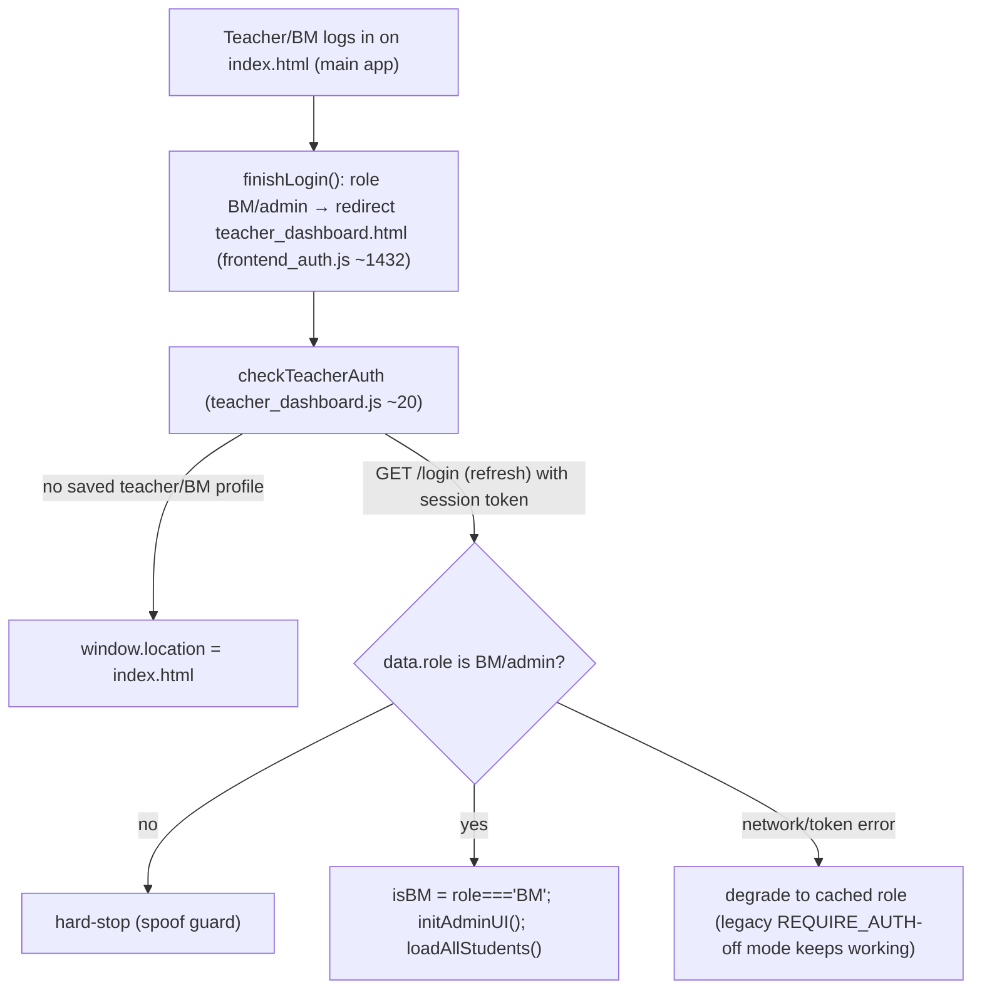

# Teacher & Admin Dashboards

> **Last verified:** 2026-09-04 · **Part of:** [Classroom-survivors Repo Wiki](README.md)

**Owner files:** `teacher_dashboard.html` (472 ln), `teacher_dashboard.js` (816 ln), `teacher_dashboard.css` (1151 ln), `admin_dashboard.js` (958 ln), `test_archive_merge_dashboard.js`

One HTML app shell (`teacher_dashboard.html`), two role views. `teacher_dashboard.js` is the base (list/filters/detail tabs); `admin_dashboard.js` (loaded AFTER it — header comment "ADMIN DASHBOARD - Additional functionality for admin role") layers on admin/BM powers: add student, settings editing, targets with manual offset, BM management. There is no separate admin HTML page — `initAdminUI()` re-skins the same shell.

## Files & load order

`teacher_dashboard.html:459-470` loads, in order:

1. `config.js`, `frontend_auth.js` (API base, `apiFetch`, app key)
2. **Inline stub:** `` — the content packs are loaded to serve the **test iframe** (`#testIframe` loads `index.html?testMode=true&…`); the stub exists so pack files parse, and `sr_engine.js`/`teaching_content.js` are deliberately NOT loaded (the dashboard never does SR math itself; it renders `srState` read-only)
3. All 7 content packs (`content_pu1/2/3.js`, `content_think0/1/2.js`, `content_test.js`)
4. `teacher_dashboard.js` (declares `let isBM = false` at top level, ~12) then `admin_dashboard.js` (declares `let isAdmin = false`, ~6) — **do not redeclare either**; both are top-level `let` shared across the two files

`apiFetch` (defined in `frontend_auth.js`) attaches `X-App-Key` + `X-Auth-Token` automatically — dashboards never hand-roll auth headers.

## Auth & role model

- `checkTeacherAuth()` (teacher_dashboard.js ~20) re-verifies the role **server-side** via `GET /login` (token refresh) to prevent localStorage spoofing; on failure it *degrades* to the cached role so the legacy no-token dashboard still works while `REQUIRE_AUTH` is off — under enforcement the privileged data calls themselves reject.
- Roles: `admin` (full: admin columns, BM management) / `BM` (add students, edit settings/targets, no admin-only columns) / plain `teacher` (view only). `initAdminUI()` (admin_dashboard.js ~8) toggles `.admin-only` / `.admin-col` / `.bm-or-admin-col` / `.bm-or-admin-only` CSS classes and sets the title ("Admin Dashboard" / "BM Dashboard").

## Student list (teacher_dashboard.js ~60-200)

`loadAllStudents()` → `GET /getStudents?includeSecure=true` (the flag is sent for BM/admin; server re-attaches plaintext passwords only for privileged callers) → filters out non-student docs (`role !== 'BM' && role !== 'admin'`) → `populateTeacherFilter()` / `populateClassTimeFilter()` (class times re-derive from the selected teacher) → `applyFilters()` (teacher + classTime + name search) → sortable table. Detail view opens per student via `loadStudentArchives` + `switchTab`.

## Student detail tabs (teacher_dashboard.js `switchTab` ~534)

| Tab | Content |
|---|---|
| **Sessions** | `renderSessions()` — `type:'session'` events, date-filtered, with detail panel; labels via `sessionTypeLabel` (`study`/`gomoku`/`uno`/`vampireSurvivors`) |
| **Exercises** | `renderExercises()` — `type:'exercise'` events; `exerciseTypeLabel` maps `wordScramble`/`spelling`/`sentenceScramble`/`sentenceMatch` + `speech_*` types |
| **Test** | `startTestMode()` (~786) — loads `index.html?testMode=true&…` into `#testIframe` to try the student's exact content assignment |
| **Settings** | `populateSettingsTab()` + `saveStudentSettings()` (admin_dashboard.js ~150/~175) |
| **Targets** | `renderTargetsTab()` + `adjustTargetOffset` (admin_dashboard.js ~222/~344) |
| **SR** | `renderSRTab()` — read-only SR state explorer; per-item popup shows interval/due/last result (admin_dashboard.js ~700-724) |

## Archive merge (the reason `getStudentArchive` exists)

`saveAnalytics` trims the live doc to ~500 recent events (auto-archive ≥700). The dashboard restores full history:

- `mergeAnalytics(live, archives)` (teacher_dashboard.js ~494, **exported pure** for `test_archive_merge_dashboard.js`): concatenates archive `events` arrays onto live, de-duping by `eventId` (fallback `timestamp`) — archives may overlap the live tail.
- `loadStudentArchives(studentId)` (~508): `GET /getStudentArchive?studentId=…` → merges into `student._fullAnalytics`; shows an archive-count badge. **Fail-safe by design:** any fetch error silently keeps the live-only view; the detail view never blocks on archives.
- `getAnalyticsInRange(student, from, to)` (~203) prefers `_fullAnalytics`, falls back to `student.analytics` — all downstream counting (sessions, durations, targets) automatically sees merged history.

## Settings tab & the password-view boundary

- `populateSettingsTab()` (admin_dashboard.js ~150): fills fullName, teacher (dropdown + custom), classTime, book/unit/page cascading selects, **`settingsLogin` (read-only + copy button via `copyLogin()` ~43)** and **`settingsPassword`** with the stored plaintext (eye-toggle `togglePwVis`).
- `saveStudentSettings()` (~175) POSTs `updateStudent` with the whitelisted field set. **Load-bearing rule:** only include `password` when the box is non-empty (`if (newPw) fields.password = newPw`, ~196-197) — an empty box means "leave unchanged". The historical empty-save bug wiped real passwords; do not "simplify" this away. The password plaintext view is the sanctioned recovery path (no email reset exists) — one-at-a-time only, never bulk-export (see [Backend API](10-backend-api.md)).

## Targets & the manual offset

- Creating targets: `setTargets` API (admin_dashboard.js ~295, ~519) — date range + session count per student.
- `renderTargetsTab()` (~222) shows per-target progress: `completed = countSessionsInRange(student, start, end) + (t.manualOffset || 0)`, with an amber "(+N manual)" note when offset > 0.
- `adjustTargetOffset(idx)` (~344): prompts for the **TOTAL** completed sessions, computes `manualOffset = newTotal - recorded`, persists via `updateStudent` `fields.targets`, reverts on failure. Guards: cannot set total below recorded (server events always count); prompt shows recorded vs offset vs total.
- `countSessionsInRange` (~259) applies the **2-minute rule**: game-mode losses under 120s survival time don't count toward targets (`isUncountedShortLoss`, shared from frontend_auth.js — anti-cheat from 2026-07-27, not retroactive). Same rule client-side ([Auth & Versioning](04-auth-versioning.md)) and in VS/UNO game-over ([Game Modes](06-game-modes.md)).
- `manualOffset` exists because teachers record out-of-band practice (WeChat-reported sessions) — see [Data Model](11-data-model.md) for the field's home in the student doc.

## BM management (admin only, admin_dashboard.js ~726-916)

`openManageBmsModal()` → three tabs backed by `manageBms` API:
- **List** (`loadBmsList` ~755): `GET /manageBms?action=list` → table of BM accounts.
- **Add** (`POST action:'add'` ~820): id/login/password/fullName — server stores BM passwords as scrypt hashes (unlike students — BMs never need teacher recovery).
- **Logs** (`loadBmActivityLogs` ~907): `GET /manageBms?action=logs` → the `bmActivity` audit trail written by `addStudent`/`updateStudent` (who changed what).

## API surface used by the dashboards

| Endpoint | Used for |
|---|---|
| `GET /login` | Role re-verification (token refresh) in `checkTeacherAuth` |
| `GET /getStudents?includeSecure=true` | Student list (privileged) |
| `GET /getStudentArchive?studentId=` | Archive merge |
| `POST /updateStudent` | Settings save, target delete/offset (fields.targets) |
| `POST /setTargets` | Bulk target creation |
| `POST /addStudent` | Add-student modal |
| `GET/POST /manageBms` | BM list/add/delete + activity logs |
| `POST /changePassword` | (student-facing; not used by dashboards) |

## Dashboard testing

- `test_archive_merge_dashboard.js` (in `npm test`): unit-tests the exported pure `mergeAnalytics` + `getAnalyticsInRange` by stubbing a minimal `document` before requiring `teacher_dashboard.js` (its DOMContentLoaded listener never fires in Node).
- **The rest of the dashboards have NO automated coverage** — the jsdom suite loads `index.html`, not `teacher_dashboard.html`. Verify `admin_dashboard.js` edits with a `vm.runInContext` harness (mind the `let isBM`/`let isAdmin` double-declaration and the `AVAILABLE_CONTENT` stub) — method in the `classroom-survivors-dev` skill's `references/dashboard_testing.md`.

## Update discipline

Any agent that changes code covered by this page must update this page in the same commit. The wiki is the single source of truth; skills/memory hold only behavior rules and point here.
